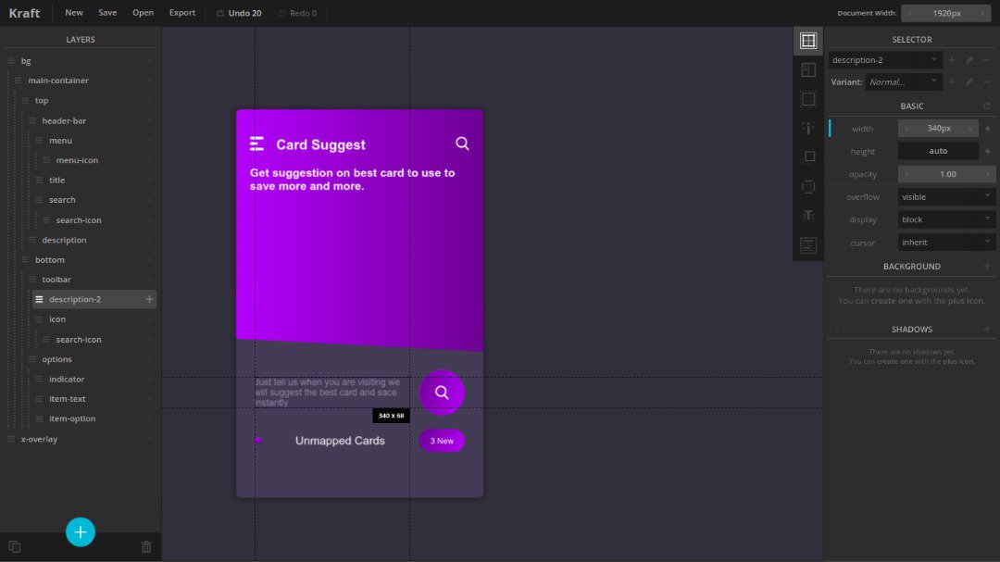
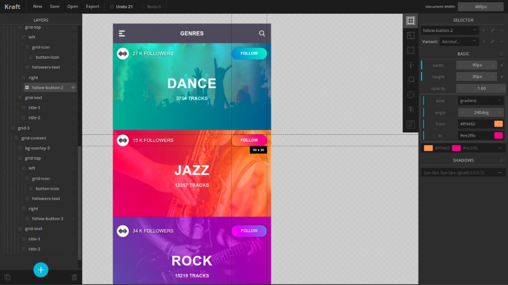

# kraft.ui

<p align="left">
  
</p>

An UI prototyping tool for high-fidelity web and mobile app prototypes wireframes. UI components can be very modular.

<p align="left">
  
  
</p>


## _prerequisites

This application requires `NodeJs` runtime to be installed,

```bash
$ sudo apt install -y nodejs
$ sudo npm i -g n
$ sudo n latest
```

## _run

```bash
$ npm start
```

## _download

Download the [Community Edition binary](https://github.com/loouislow81/kraft.ui/releases/tag/4.6.22) for Linux.

---

[MIT](https://github.com/loouislow81/kraft.ui/blob/master/LICENSE)
